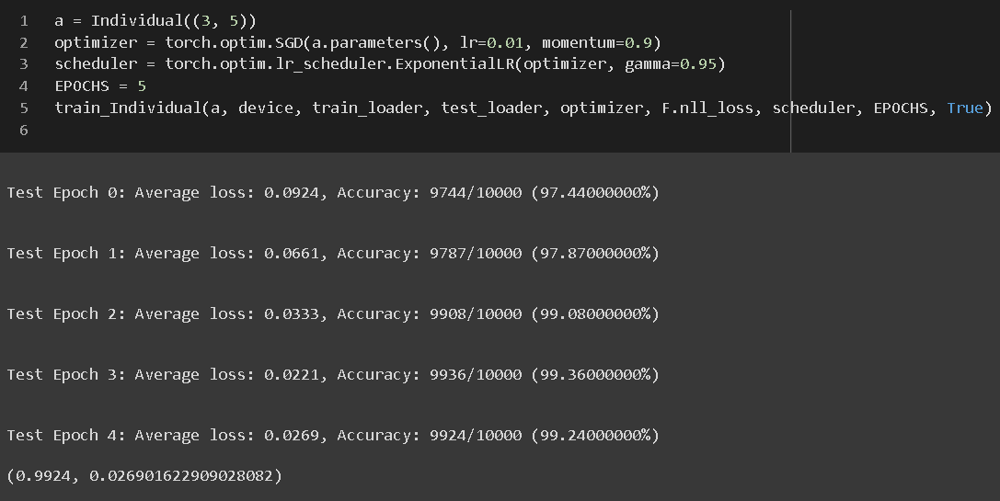

# REWRITE GENETIC CNN BY TORCH

Rewrite for torch with following paper: Lingxi Xie and Alan L. Yuille <a href="https://arxiv.org/abs/1703.01513">Genetic CNN</a>

## Class format flow

## Visualize Class format flow

## Stage (complete)

Example
- num_nodes = 5
- binary_code = 1100000001
- separated_connections = 1-10-000-0001

## Stages (complete)

Example
- num_stages = (6, 9, 8)
- binary_code_stages_model = {'S_1': '1-00-010-0110-00100', 'S_2': '0-00-000-1001-01101-001110-0101101-00001110', 'S_3': '1-01-001-1100-10011-011100-1100110'}

<table>
<thead>
  <tr>
    <th colspan="3">Stages</th>
    <th colspan="2">Stage</th>
  </tr>
</thead>
<tbody>
  <tr>
    <td rowspan="2">stages</td>
    <td colspan="2">binary_code_stages_model</td>
    <td rowspan="2">binary_code</td>
    <td rowspan="2">num_nodes</td>
  </tr>
  <tr>
    <td>index</td>
    <td>separated connections</td>
  </tr>
  <tr>
    <td>0</td>
    <td>S_1</td>
    <td>1-00-010-0110-00100</td>
    <td>100010011000100</td>
    <td>6</td>
  </tr>
  <tr>
    <td>1</td>
    <td>S_2</td>
    <td>0-00-000-1001-01101-001110-0101101-00001110</td>
    <td>000000100101101001110010110100001110</td>
    <td>9</td>
  </tr>
  <tr>
    <td>2</td>
    <td>S_3</td>
    <td>1-01-001-1100-10011-011100-1100110</td>
    <td>1010011100100110111001100110</td>
    <td>8</td>
  </tr>
</tbody>
</table>

## Individual (complete)

Training on single Individual with MNIST run 5 epochs

## Population & Genetic Algorithm (complete)

 run cells: `import`, `class Population`, `test`

See example output in files [test1.log](./test1.log), [test2.log](./test2.log)

# ENVIRONMENT REQUIREMENTS

- pytorch >= 1.9

